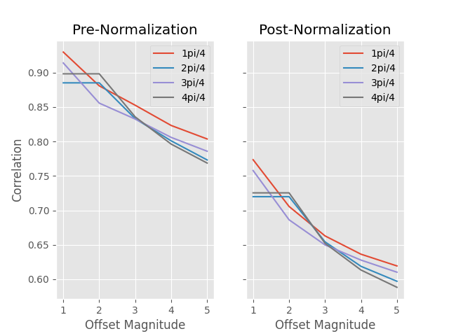
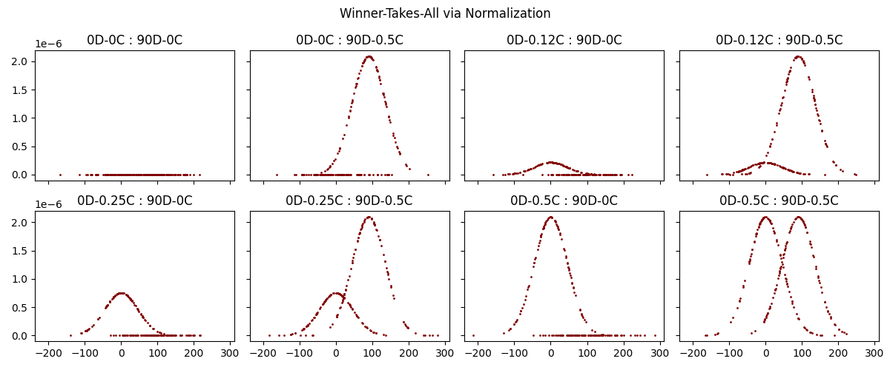
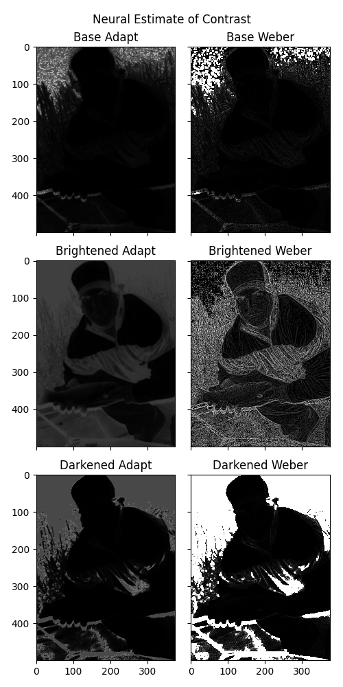
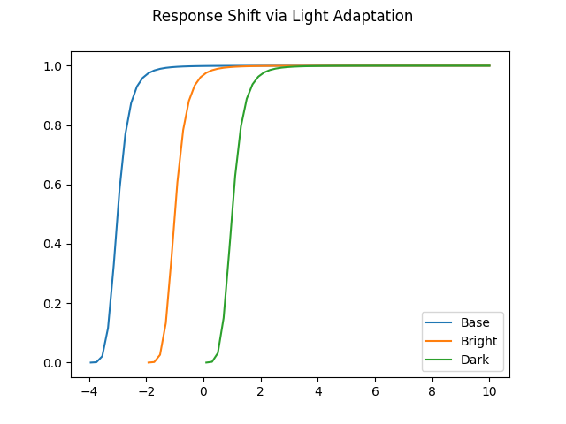

# Normalization as as Canonical Neural Operation (Carandini & Heeger)

The computational benefits of normalization include maximizing sensitivity, providing invariance with respect to some stimulus dimensions at the expense of others, facilitating the decoding of a distributed neural representation, facilitating the discrimination among representations of different stimuli, providing max-pooling (winner-take-all competition) and reducing redundancy

Here, we implement and simulate the empirical normalization results of Carandini & Heeger via computational models.

---
### Replicating Results :

Please first download [Imagenette](https://github.com/fastai/imagenette) (a subset of Imagenet) and update the appropriate path in `data_helper.py`

To demonstrate how input redundancies are reduced (proxied by pixel decorrelation) via normalization, run:
```
python decorrelate.py
``` 


To demonstrate how input neuronal populations undergo winner-takes-all behavior under the normalization framework, run:
```
python winner.py
``` 


To see how normalization effectively performs light adaptation and estimates neural contrast, run:
```
python adaptation.py
```

 


